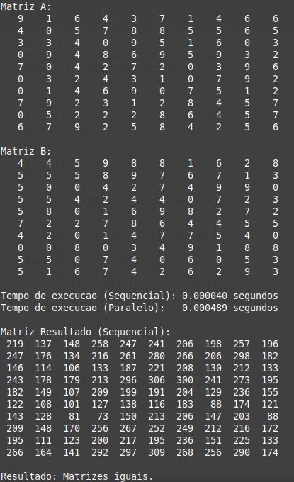
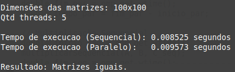
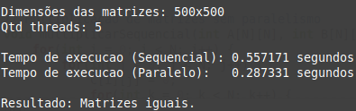

# Multiplicação de Matrizes com OpenMP

Implementação em C para multiplicação de matrizes de forma sequencial e paralela utilizando **OpenMP**. O projeto visa comparar o desempenho das abordagens e demonstrar os ganhos do paralelismo para matrizes de grandes dimensões.

## Como compilar

```bash
gcc main.c -o main -fopenmp
```

## Como executar

```bash
./matriz_openmp
```

O número de **threads** pode ser configurado no código através da constante:

```c
#define NUM_THREADS 4
```

## Exemplo de execução

### Matriz 10x10

- Impressão completa das matrizes A, B e C.
- Resultados:



---

### Matriz 100x100

- Impressão apenas das dimensões, número de threads, tempos de execução e confirmação da igualdade das matrizes.



---

### Matriz 500x500

- Impressão das mesmas informações da matriz 100x100.
- Demonstrou ganho de desempenho com paralelismo.



---

## Resultados observados

- Para matrizes **pequenas**, o paralelismo pode ser ineficiente devido ao **overhead**.
- Para matrizes **grandes**, o paralelismo **reduz significativamente** o tempo de execução.

---

## Licença

Este projeto está licenciado sob a [escolha da licença].
